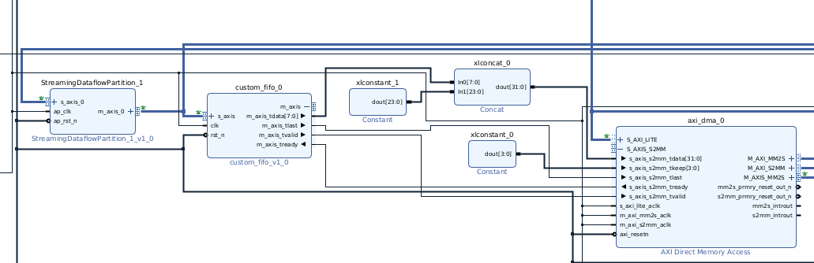
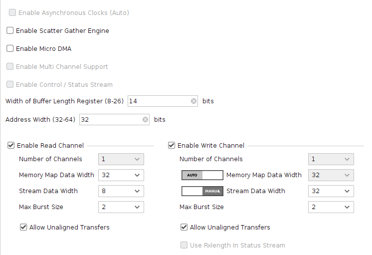

# Manual inference : A bonus sub-tutorial

> [!CAUTION]
> This part is not like the others, it will be hard for you to do it 100% on your own if you are a beginner. The video will contain more details on this part (and include a bit of debugging insights). Use the video as support to help you getting through this part ! I also expect the reader to have some knowledge ith xilinx tools. If you are a complete beginner, check the ressource from the [main readme](../README.md) for some of my video or directly go on my channel to check for my early tutorials.

## Why manual inference ?

FINN Provides a very nice runtime environement based on Pynq to run FPGA inference directly from a notebook.

However, you might want to run inference on other (unsuported) FPGA boards. Given that only 2 boards are made for PYNQ and only [a few](http://www.pynq.io/boards.html) are officially supported at the moment, we will do the FPGA inference manually.
This allows for better understanding and flexibility for your future projects.

To do so, we will go over various steps to make it work.

- 0 => Find the FINN exportoted stitched IP and integrate this to your vivado project
- 1 => Create our own "glue logic" IP to interface between the model and Xilinx's DMA IP
- 2 => Run synth & impl and export to vitis
- 3 => Create software to run inference using DMA's drivers

## What is in this folder ?

This folder contains :

- HARDWARE : The glue logic IP's System Verilog code (use  the ```git clone --recursive``` flag to clone the sub repo if needed or access it [here](https://github.com/0BAB1/Axi-Stream-FIFO-for-FINN))
- SOFTWARE : The code we'll run in Vitis
- SOFTWARE : A data generator for C inference of MNIST data.

## How do I run manual inference

> Note that this is just a minimalist example and your applications/projects might need another architecture.

## 0 : Find the FINN exportoted stitched IP and integrate this to your vivado project

During PART 2, we used FINN to generate a "stitched IP" that conviniently generated a zynq project for us. Regardless of the workflow you chose (FINN has multple workflows like a [CLI](https://finn.readthedocs.io/en/latest/command_line.html) or [Custom builders](https://finn.readthedocs.io/en/latest/command_line.html) that does all we did in LAB in a automated way), you will always have a collection of outputs including :

- The different layers as IPs
- A stitched IP

After PART 2, you can access the stitched IP by opinning the ```/tmp/finn_dev_yourusername``` folder, you will then find a range of output product.
We are going to focus on the ```vivado_zynq_xxx.../``` folder and open the .xpr using vivado.

**Important :** Before doing anything, go in the project settings and chage the target part/board !

> For this part, the video teaser of the turial includes more details. It was meant to be useful ! don't hesitate to go back to the video on part 3 to see where was my output model from PART2, how i found it and how I preped the vivado project.

## 1 : Create our own "glue logic" IP to interface between the model and Xilinx's DMA IP

DMA Tutorial [here](https://www.youtube.com/watch?v=aySO9jCKj9g) for begginers.

> You have all al the HDL for the custom glue logic in this repo (use got clone --recursive to clone it directly with this repo). Agin, check the video if you have any doubt on how to make a custom IP block from HDL.

With the output vivado project oppened, we will now proceed to delete every IP used in the block design **except for the stiched IP**, we will keep it a build our system around it.

As we can see, the stiched IP is very conviently packed with simplifed stream interfaces and expects a 8bits input for the data, just as planed !

But there is a problem : to transfer data, we will use Xilinx's DMA IP that need TLAST signal to function properly.

You can create a custom FIFO IP using the HDL in this repo's folder in order to handle the correct signals assertion for DMA to function properly.

Then add this custom IP Right after the FINN IP.

We then add the usual DMA etc.. to send data to the model via AXI Stream directly from memory. [Here is a small tutorial illustrating how to use DMA](https://www.youtube.com/watch?v=aySO9jCKj9g)

The end custom system should then look like this :


> [!CAUTION]
> As you saw in the video, some weird stuff happens when you configure the custom FIFO data width to 32 bits to match the one of DMA. Here's a good way to get around this : 
> this consits in not changing the default 8bits data width of the fifo and letting the DMA operate in 32 its with memory.
> To avoid mismatch between the 8bits fifo and the 32bits dma interfaces, we connect them manually using constants and concat blocks, this process is
> described in the video.

**ANYWAY**, here are the working configs used in the tutorial at the end with the concat and const manual connections :



And the fianl DMA config :



## 2 : Run synth & impl and export to vitis

This step is not a step per say, you simply have to generate a bitsteam and export the resulting hardware to Vitis so we can use the drivers to generate some software

> Also brefely described in the video, my channel also has more [basic tutorials](https://www.youtube.com/watch?v=zJJTxOT37K4) on this workflow.

## 3 : Create software to run inference using DMA's drivers

Once in vitis with platform & app components created, you can take inspiration from the code in the repo's "vitis prgram folders".

You also have, in this repo, a main.py file that will generate random quantized (UINT8) data alongside the corresponding labels and put these in a header file to use in our software.

> Note : Be sure that your heap and stack size complies with the number of samples you will load in memory (I use 0xf000 for both stack and heap to run this example). You can modify this parameter in linker.ld in the src/ folder. Or you can lower the number of generated samples in the python generator (e.g. 0x2000 size fits 20 samples pretty well on my side).

At the end of the day, you should have (in Vitis):

- src/
  - [main.c](./vitis_software/main.c) (with ```#include <mnist_samples.h>```)
  - mnist_samples.h, generated by executing [this python script](./vitis_software/generate_test_data.py)
  - linker.ld (modified linker to increase heap & stack size)

When this is done, you can simply build the code and flash it onto your FPGA.

## 4 : What is next ?

This is the part where you figure out whether you need to spend hours to debug or enjoy a nicely build project.

- Open UART tty
- Run debuging mode, observe results
- Compare FPGA accuracy with python simulations (asserted equal)
- Use system ILA to debug DMA & Drivers problems

Do not hesitate to open an Issue or contact if you have a problem. Here is a final output example :


> If you need to debug stuff, use ILA. If you are lost, reach out to me in the video comments.

Quick note : I'm planning to do an ILA tutorial in the next few month in case the next videos take to much time to produce. In which case I will post the link here, In the meantime, internet is full of tutorials for this, they just tend to not be the best quality...
